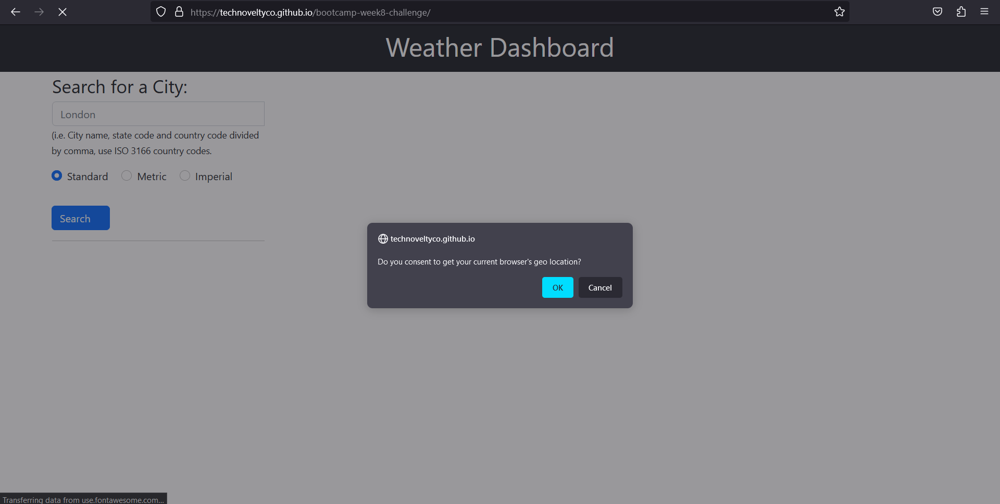
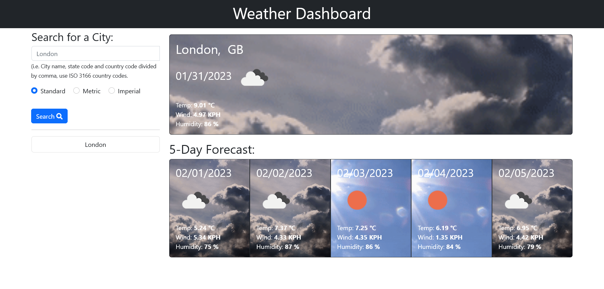
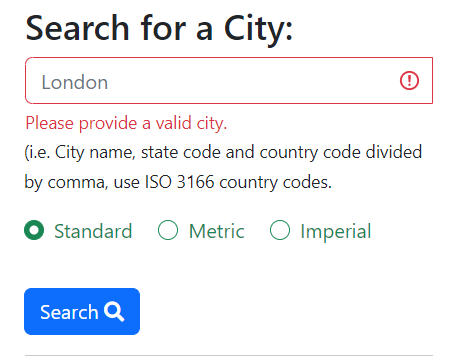
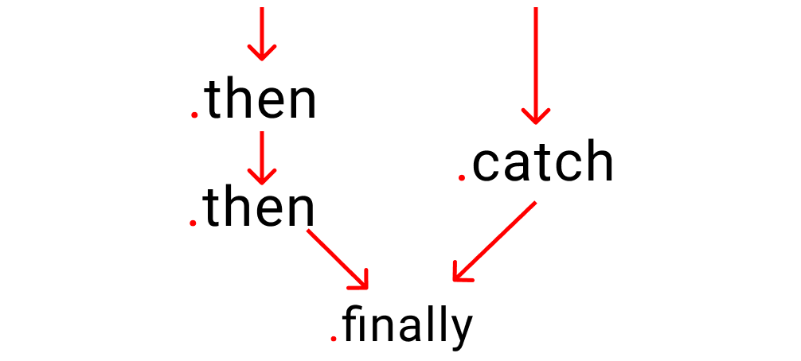

# Weather Dashboard App

Server APIs: Weather Dashboard

<p align="center">
    
    
    
    
</p>

<p align="center">
    
    
    
    
    
    
</p>


## Table of contents

- [Weather Dashboard App](#weather-dashboard-app)
  - [Table of contents](#table-of-contents)
  - [Overview](#overview)
    - [The challenge](#the-challenge)
    - [Screenshot](#screenshot)
    - [Links](#links)
  - [My process](#my-process)
    - [Built with](#built-with)
    - [What I learned](#what-i-learned)
    - [Continued development](#continued-development)
    - [Useful resources](#useful-resources)
  - [Author](#author)
  - [Acknowledgments](#acknowledgments)

## Overview

In this Challenge, you'll create an app that allows users to see the weather forecast for cities of their choosing.

### The challenge

Server APIs allow developers to access their data and functionality by making requests with specific parameters to a URL. Developers are often tasked with retrieving data from another application's API and using it in the context of their own. Your challenge is to build a weather dashboard that will run in the browser and feature dynamically updated HTML and CSS.

Use the [5 Day Weather Forecast](https://openweathermap.org/forecast5) to retrieve weather data for cities. The link should take you to a guide on how to use the 5 Day Forecast API. You will need to register for an API key in order to use this API. After registering for a new API key, you may need to wait up to 2 hours for that API key to activate.

The base URL for your API calls should look like the following: `https://api.openweathermap.org/data/2.5/forecast?lat={lat}&lon={lon}&appid={API key}`.

**Hint**: Using the 5 Day Weather Forecast API, you'll notice that you will need to pass in coordinates instead of just a city name. Using the OpenWeatherMap APIs, how could we retrieve geographical coordinates given a city name?

You will use `localStorage` to store any persistent data. For more information on how to work with the OpenWeather API, refer to the [Full-Stack Blog on how to use API keys](https://coding-boot-camp.github.io/full-stack/apis/how-to-use-api-keys).

### Screenshot

The Weather Dashboard will ask for user's consent before using the browser's geolocation to resolve the default weather forecast.



The search feature will resolve the geocoding of the location input, and it saves the sucessful forecasts results in a history log storage ordered by the most recent queries.



Moreover, the search will validate the form before submission and will only send a API request when there is a valid input.



### Links

- Solution URL: [https://github.com/technoveltyco/bootcamp-week8-challenge/](https://github.com/technoveltyco/bootcamp-week8-challenge/)
- Live Site URL: [https://technoveltyco.github.io/bootcamp-week8-challenge/](https://technoveltyco.github.io/bootcamp-week8-challenge/)

## My process

The Weather App has been implemented using the IIEF _(immediately invoked function expression)_ pattern to prevent leaking local variables to the global scope and capturing and isolating the global objects.

Moreover, the software has been designed to separate the functionalities into two layers: private and public APIs. 

- **Private API:** contain the internal interfaces that communicates the Open Weather API with the Web APIs, and controls the logic for fetching, filtering, mapping, formatting and storing of the data models, and displaying the views in the HTML.
- **Public API:** provides of global interfaces that allow to configure and control the execution of the Weather Dashboard. The interfaces that are accessible from the global scope are:
  - `VERSION`: The current semantic version of the weather app. 
  - `DEBUG`: The current debug mode flag. When enabled, it will print some logs in the console.
  - `LOCALE`: The current locale setting. It is used to configure moment.js and Open Weather API language.
  - `GEODISCOVERY`: The current geolocation mode flag. It is used to enable the use of the browser's Geolocation API and the user consent.
  - `setDebug(debug)`: Sets the `DEBUG` mode flag. It only accepts `boolean`.
  - `setLocale(locale)`: Sets the `LOCALE` setting.
  - `setGeoDiscovery(geodiscovery)`: Sets the `DEBUG` mode flag. It only accepts `boolean`.
  - `init({ apikey, debug, locale, geodiscovery})`: Initialise the Weather App configuration eith settings like, the Weather API key, the debug mode, the locale setting, and enable/disable the use of the browser's Geolocation.  
  - `run()`: Executes the main worflow of the Weather App.
  - `reset()`: Clear all the HTML containers, data and local storage.

### Built with

- Semantic HTML5 markup
- CSS
- Vanilla JavaScript
- [Bootstrap 5](https://getbootstrap.com/docs/5.2/getting-started/introduction/)
- [Moment.js](https://momentjs.com/)
- [Open Weather API](https://openweathermap.org/api)

### What I learned

The IIEF (immediately invoked function expression) pattern and the different use cases in JavaScript.

```js
// Most commonly used.
(function () {
  // ...
})();

// Variants.
+function () {
  // ...
}();
-function () {
  // ...
}();
~function () {
  // ...
}();
```

The use of callbacks, Promises and async/await syntax for asychronous programming in JavaScript.

```js
////
// Callbacks
////
function one() {
  // ...
}
function two(call_one) {
  // ...
  call_one();
}
two(one);

////
// Callbacks with arrow functions
////
let order = (call_production) =>{
  console.log("Order placed. Please call production")

  // function 👇 is being called 
  call_production();
};
let production = () =>{
  console.log("Production has started")
};
order(production);

////
// Callbacks hell
////
let production = () =>{

  setTimeout(()=>{
    console.log("production has started")
    setTimeout(()=>{
      console.log("The fruit has been chopped")
      setTimeout(()=>{
        console.log(`${stocks.liquid[0]} and ${stocks.liquid[1]} Added`)
        setTimeout(()=>{
          console.log("start the machine")
          setTimeout(()=>{
            console.log(`Ice cream placed on ${stocks.holder[1]}`)
            setTimeout(()=>{
              console.log(`${stocks.toppings[0]} as toppings`)
              setTimeout(()=>{
                console.log("serve Ice cream")
              },2000)
            },3000)
          },2000)
        },1000)
      },1000)
    },2000)
  },0000)

};
```

```js
////
// Promises
////
let order = ( time, work ) => {
  return new Promise( ( resolve, reject )=>{
    if( is_shop_open ){
      setTimeout(()=>{
        // work is 👇 getting done here
        resolve( work() )

// Setting 👇 time here for 1 work
      }, time)
    }
    else{
      reject( console.log("Our shop is closed") )
    }
  });
};

// Set 👇 time here
order( 2000, ()=>console.log(`${stocks.Fruits[0]} was selected`))
//    pass a ☝️ function here to start working

////
// Chaining after a error handling catch, and finally handler
////
new Promise((resolve, reject) => {
  console.log("Initial");
  resolve();
})
  .then(() => {
    throw new Error("Something failed");
    console.log("Do this");
  })
  .catch(() => {
    console.error("Do that");
  })
  .then(() => {
    console.log("Do this, no matter what happened before");
  })
  .finally(()=>{
    console.log("end of day")
  });

```



```js
////
// The keywords async/await
////

//👇 Magical keyword
async function kitchen(){

   try{
// Let's create a fake problem      
      await abc;
   }

   catch(error){
      console.log("abc does not exist", error)
   }

   finally{
      console.log("Runs code anyways")
   }
}

kitchen()  // run the code
```

### Continued development

The following issues are open to extend the documentation and functionality improvements:

- [Design](https://github.com/technoveltyco/bootcamp-week8-challenge/issues/3#issue-1561247383)
- [Improvements](https://github.com/technoveltyco/bootcamp-week8-challenge/issues/5#issue-1561248499)

### Useful resources

- [MDN JavaScript Docs](https://developer.mozilla.org/en-US/docs/Web/javascript)
- [MDN Geolocation API](https://developer.mozilla.org/en-US/docs/Web/API/Geolocation_API)
- [MDN Accessibility Docs](https://developer.mozilla.org/en-US/docs/Web/Accessibility)
- [W3School JavaScript Tutorial](https://www.w3schools.com/js/DEFAULT.asp)
- [Bootstrap 5 Docs](https://getbootstrap.com/docs/5.2/getting-started/introduction/)
- [JQuery API Docs](https://api.jquery.com/)
- [Moment.js Docs](https://momentjs.com/)
- [Open Weather 5 days/ 3 hours Forecast](https://openweathermap.org/forecast5)
- [Open Weather Geocoding API](https://openweathermap.org/api/geocoding-api)
- [Use Cases for JavaScript's IIFEs](https://mariusschulz.com/blog/use-cases-for-javascripts-iifes)
- [Disassembling JavaScript's IIFE Syntax](https://mariusschulz.com/blog/disassembling-javascripts-iife-syntax)
- [What function window, document, undefined - window, document really means](https://ultimatecourses.com/blog/what-function-window-document-undefined-iife-really-means)
- [When (and why) you should use ES6 arrow functions — and when you shouldn’t](https://www.freecodecamp.org/news/when-and-why-you-should-use-es6-arrow-functions-and-when-you-shouldnt-3d851d7f0b26/)
- [JavaScript Range – How to Create an Array of Numbers with .from() in JS ES6](https://www.freecodecamp.org/news/javascript-range-create-an-array-of-numbers-with-the-from-method/)
- [Private properties in JavaScript](https://curiosity-driven.org/private-properties-in-javascript)
- [JavaScript Async/Await Tutorial – Learn Callbacks, Promises, and Async/Await in JS by Making Ice Cream](https://www.freecodecamp.org/news/javascript-async-await-tutorial-learn-callbacks-promises-async-await-by-making-icecream/)
- [How to Use Async/Await in JavaScript with Example JS Code](https://www.freecodecamp.org/news/async-await-in-javascript/)
- [Promises, async/await](https://javascript.info/async-await)

## Author

  Daniel Rodriguez
- GitHub - [Technoveltyco](https://github.com/technoveltyco)

## Acknowledgments

The teacher and TAs that help us with resources and support to my questions during the development of this challenge.
